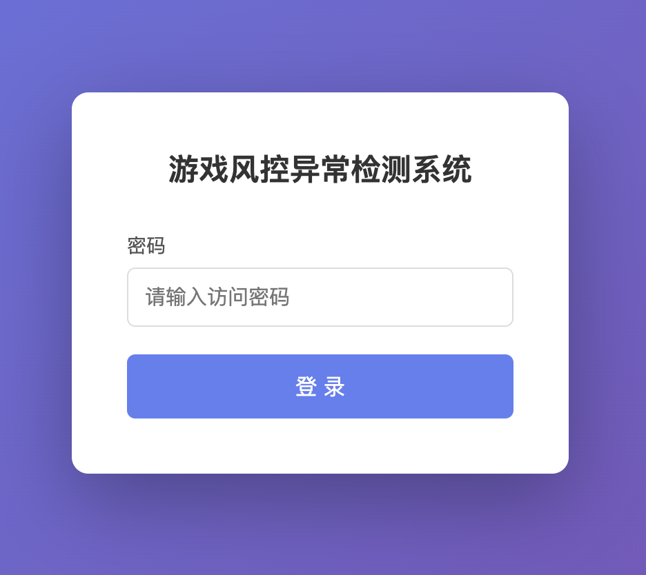
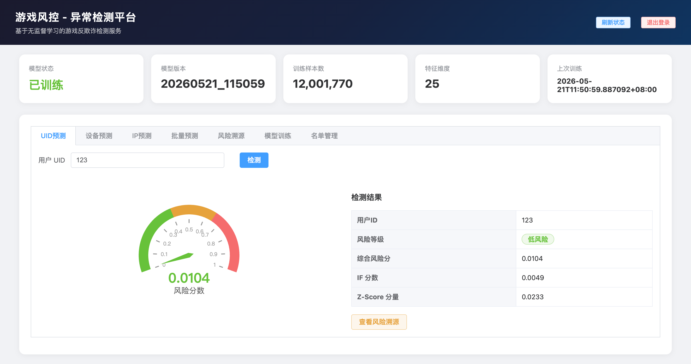

# Game Fraud Detection (Unsupervised)

基于无监督学习的游戏风控异常检测服务。使用 Isolation Forest + Z-score 集成模型，从玩家行为日志中自动识别欺诈账号，无需标注数据。

## 目录

- [架构概览](#架构概览)
- [技术栈](#技术栈)
- [项目结构](#项目结构)
- [快速开始](#快速开始)
- [配置说明](#配置说明)
- [鉴权说明](#鉴权说明)
- [API 接口](#api-接口)
- [特征工程](#特征工程)
- [检测模型](#检测模型)
- [风险溯源](#风险溯源)
- [定时任务](#定时任务)
- [名单管理](#名单管理)
- [前端界面](#前端界面)

---

## 架构概览

```
请求 → FastAPI (中间件: trace_id 注入 + 日志) → 路由
                                                  │
              ┌───────────────────────────────────┤
              │                                   │
         名单检查                            特征提取
    (白名单/黑名单)                    (6 类数据源并发查询)
              │                                   │
              │                              模型预测
              │                     (Isolation Forest + Z-score)
              │                                   │
              │                              风险溯源
              │                       (Top-N 异常特征解释)
              │                                   │
              └───────────────────────────────────┤
                                                  ▼
                                            JSON 响应
                                    (含 trace_id + 溯源信息)
```

---

## 技术栈

| 组件 | 技术 |
|------|------|
| Web 框架 | FastAPI + Uvicorn |
| 数据库 | MySQL (aiomysql 异步连接池) |
| ML 模型 | scikit-learn IsolationForest + scipy |
| 数据处理 | pandas, numpy |
| 模型持久化 | joblib (版本化存储) |
| 定时任务 | APScheduler |
| 配置管理 | pydantic-settings |
| 日志 | loguru (按天 + 按大小轮转) |
| 前端 | Vue 3 + Element Plus + ECharts |

---

## 项目结构

```
game-fraud-detection-unsupervised/
├── api/
│   ├── app.py              # 应用工厂、生命周期、中间件 (鉴权 + trace_id 注入)
│   ├── routes.py           # API 路由 (10 个端点)
│   └── schemas.py          # Pydantic 请求/响应模型
├── db/
│   ├── connection.py       # MySQL 连接池、异步查询执行
│   └── queries.py          # SQL 构建器
├── features/
│   ├── registry.py         # 特征注册表 (25 个特征定义)
│   └── engineering.py      # 特征提取管道
├── model/
│   ├── detector.py         # Isolation Forest + Z-score 集成检测器
│   └── storage.py          # 模型版本化存储 (joblib)
├── scheduler/
│   └── tasks.py            # 定时训练 + 名单刷新
├── trace/
│   └── explainer.py        # Z-score 异常分析、欺诈类型映射
├── static/
│   └── index.html          # 前端管理界面
├── config.py               # 全局配置 (数据库、模型、API)
├── listmanager.py          # 黑白名单管理
├── main.py                 # 入口 (日志 + Uvicorn)
├── run.sh                  # 启动脚本
├── setup_venv.sh           # 环境安装脚本
└── requirements.txt        # Python 依赖
```

---

## 快速开始

### 环境要求

- Python 3.10+
- MySQL 数据库 (已配置表结构)

### 安装与启动

```bash
# 后台启动 (自动创建虚拟环境、安装依赖)
./run.sh

# 自定义端口
./run.sh --port 9000

# 开发模式 (前台 + 热重载)
./run.sh --reload

# 查看状态
./run.sh status

# 停止服务
./run.sh stop
```

### 首次使用

1. 复制并填写环境配置：

   ```bash
   cp .env.example .env
   # 编辑 .env，填写数据库连接和签名密钥
   ```

2. 启动服务后访问 `http://localhost:8000/login`，输入访问密码登录前端管理界面
3. 在"模型训练"页面触发首次训练（或调用 `POST /api/v1/train`）
4. 训练完成后即可使用预测接口

---

## 配置说明

通过环境变量（前缀 `FRAUD_`）或 `.env` 文件覆盖默认值，配置项定义在 `config.py`：

| 配置项 | 默认值 | 说明 |
|--------|--------|------|
| `MYSQL_HOST` | — | 数据库地址 |
| `MYSQL_PORT` | 3306 | 数据库端口 |
| `MYSQL_USER` | — | 数据库用户名 |
| `MYSQL_PASSWORD` | — | 数据库密码 |
| `MYSQL_DB` | — | 数据库名 |
| `MYSQL_POOL_SIZE` | 10 | 连接池大小 |
| `FEATURE_WINDOW_DAYS` | 30 | 训练特征窗口（天） |
| `FEATURE_PREDICT_WINDOW_DAYS` | 2 | 预测特征窗口（天） |
| `IF_N_ESTIMATORS` | 300 | Isolation Forest 树数量 |
| `IF_CONTAMINATION` | 0.02 | 预期异常比例（2%） |
| `IF_WEIGHT` | 0.7 | IF 分数权重 |
| `ZSCORE_WEIGHT` | 0.3 | Z-score 分数权重 |
| `RISK_THRESHOLD_HIGH` | 0.90 | 高风险阈值 |
| `RISK_THRESHOLD_MEDIUM` | 0.50 | 中风险阈值 |
| `TRACE_TOP_N` | 5 | 溯源展示 Top-N 异常特征 |
| `TRAINING_CRON_HOUR` | 3 | 定时训练小时 |
| `TRAINING_CRON_MINUTE` | 0 | 定时训练分钟 |
| `BLOCKLIST_REFRESH_MINUTES` | 10 | 名单刷新间隔（分钟） |
| `API_PORT` | 8000 | 服务端口 |
| `MODEL_DIR` | saved_models/ | 模型保存目录 |
| `SIGN_SECRETS` | — | source → secret 映射（JSON 对象） |
| `SIGN_EXPIRE_SECONDS` | 300 | 签名有效期（秒） |

`.env` 示例：

```dotenv
FRAUD_MYSQL_HOST=your-db-host
FRAUD_MYSQL_USER=your-db-user
FRAUD_MYSQL_PASSWORD=your-db-password
FRAUD_MYSQL_DB=your-db-name
FRAUD_SIGN_SECRETS={"test":"your-test-secret","other":"your-other-secret"}
```

---

## 鉴权说明

### 前端页面鉴权（Cookie）

访问 `/` 及 `/static/*` 需要先登录。

- 登录入口：`GET /login`
- 提交密码：`POST /login`，请求体 `{"password": "<SIGN_SECRETS 中 test 对应的 secret>"}`
- 验证通过后设置 httponly cookie（有效期 7 天），登录状态期间前端调用 `/api/` 无需额外签名

### API 接口鉴权（MD5 签名）

所有 `/api/v1/*` 接口（未携带有效登录 cookie 时）需要在请求头中提供签名：

| Header | 说明 |
|--------|------|
| `X-Source` | 调用方标识，需在 `SIGN_SECRETS` 中配置 |
| `X-Timestamp` | Unix 时间戳（秒），与服务器时差不超过 `SIGN_EXPIRE_SECONDS` |
| `X-Sign` | MD5 签名 |

**签名计算方式：**

```
# 1. 将请求 JSON body 的所有 key 按字母序排序
sorted_params = "&".join(f"{k}={v}" for k, v in sorted(body.items()))

# 2. 拼接时间戳和密钥
raw = f"{sorted_params}&timestamp={X-Timestamp}&secret={secret}"

# 3. MD5
X-Sign = md5(raw).hexdigest()
```

**Python 示例：**

```python
import hashlib, time, json, requests

source = "test"
secret = "your-test-secret"   # 从配置获取
timestamp = str(int(time.time()))
body = {"uid": "123456"}

sorted_parts = "&".join(f"{k}={body[k]}" for k in sorted(body))
raw = f"{sorted_parts}&timestamp={timestamp}&secret={secret}"
sign = hashlib.md5(raw.encode()).hexdigest()

resp = requests.post(
    "http://localhost:8000/api/v1/predict",
    json=body,
    headers={"X-Source": source, "X-Timestamp": timestamp, "X-Sign": sign},
)
print(resp.json())
```

---

## API 接口

基础路径：`/api/v1`

所有 JSON 响应自动包含 `trace_id` 字段，用于请求追踪和日志关联。

### 预测接口

#### POST /predict

单用户风险预测，返回风险评分及溯源信息。

```json
// 请求
{"uid": "123456"}

// 响应
{
  "uid": "123456",
  "risk_score": 0.92,
  "risk_label": "high",
  "if_score": 0.88,
  "zscore_component": 0.95,
  "is_whitelisted": false,
  "is_blacklisted": false,
  "primary_risk_types": ["盗刷", "洗钱"],
  "top_anomalous_features": [
    {
      "feature": "payment_per_activity",
      "description": "单次活跃付费金额",
      "user_value": 580.0,
      "population_median": 12.5,
      "population_mean": 25.3,
      "z_score": 7.2,
      "direction": "above",
      "suspected_fraud_types": ["盗刷"]
    }
  ],
  "summary": "用户 123456 被识别为高风险(评分 0.92)，疑似盗刷行为：...",
  "trace_id": "a1b2c3d4e5f6"
}
```

#### POST /batch-predict

批量预测，最多 500 个用户。

```json
// 请求
{"uids": ["uid1", "uid2", "uid3"]}

// 响应
{
  "results": [...],
  "total": 3,
  "high_risk_count": 1,
  "medium_risk_count": 0,
  "low_risk_count": 2,
  "trace_id": "..."
}
```

#### POST /predict-device

按设备指纹预测关联账号风险。

```json
// 请求
{
  "imei": "",
  "oaid": "example_oaid",
  "device_brand": "Samsung",
  "device_model": "Galaxy S21"
}

// 响应
{
  "device_fp": "example_oaid",
  "associated_uids": 3,
  "high_risk_count": 1,
  "medium_risk_count": 1,
  "low_risk_count": 1,
  "trace_id": "..."
}
```

#### POST /predict-ip

按 IP 地址预测关联账号风险。

```json
// 请求
{"ip": "1.2.3.4"}

// 响应
{
  "ip": "1.2.3.4",
  "associated_uids": 5,
  "high_risk_count": 2,
  "medium_risk_count": 1,
  "low_risk_count": 2,
  "trace_id": "..."
}
```

### 溯源接口

#### GET /trace/{uid}

获取用户详细风险解释。

```json
{
  "uid": "123456",
  "risk_score": 0.92,
  "risk_label": "high",
  "primary_risk_types": ["盗刷"],
  "top_anomalous_features": [...],
  "summary": "用户 123456 被识别为高风险...",
  "trace_id": "..."
}
```

### 训练接口

#### POST /train

手动触发模型训练。

```json
// 请求
{"full_retrain": false}

// 响应
{
  "status": "success",
  "trained_at": "2026-05-22T03:00:00+08:00",
  "sample_count": 15000,
  "version": "20260522_030000",
  "feature_count": 25,
  "trace_id": "..."
}
```

### 模型状态

#### GET /model/status

查看当前模型元数据。

### 名单管理

| 方法 | 路径 | 说明 |
|------|------|------|
| GET | /blocklist | 查询名单（`?type=uid\|device\|ip&list_type=whitelist\|blacklist`） |
| POST | /blocklist | 添加名单条目 |
| DELETE | /blocklist | 删除名单条目（`?key=...&type=...&list_type=...`） |

---

## 特征工程

从 6 类数据源并发提取 25 个特征，覆盖 5 个维度。

### 数据源

| 数据源 | 说明 |
|--------|------|
| 注册日志 | 注册时间、设备信息 |
| 登录日志 | 登录频次、时段分布 |
| 角色创建 | 角色/区服数量 |
| 游戏内行为 | 游戏活跃度 |
| 下单日志 | 下单金额/频次 |
| 付费成功日志 | 实际付费金额/频次 |

### 特征列表

#### 设备/环境（5）

| 特征 | 说明 | 关联欺诈类型 |
|------|------|-------------|
| distinct_device_count | 使用的不同设备数量 | 账号交易 |
| distinct_ip_count_daily | 日均使用的不同 IP 数量 | 账号交易、代练 |
| is_simulator_ratio | 模拟器登录比例 | 脚本/外挂、工作室 |
| device_brand_count | 设备品牌多样性 | 账号交易 |
| device_model_count | 设备型号多样性 | 账号交易 |

#### 行为模式（6）

| 特征 | 说明 | 关联欺诈类型 |
|------|------|-------------|
| register_to_first_login_seconds | 注册到首次登录时间（秒） | 批量注册、机器人 |
| login_frequency_daily | 日均登录频次 | 脚本/外挂、机器人 |
| login_hour_entropy | 登录时段分布熵（低=机器人） | 脚本/外挂、机器人 |
| role_count | 创建角色数量 | 多开、工作室 |
| server_count | 进入区服数量 | 多开、工作室 |
| night_activity_ratio | 凌晨活跃比例（0:00–6:00） | 脚本/外挂、机器人 |

#### 下单（6）

| 特征 | 说明 | 关联欺诈类型 |
|------|------|-------------|
| total_payment_daily | 日均下单总金额 | 洗钱、盗刷 |
| avg_payment | 平均单笔下单金额 | 盗刷 |
| payment_frequency | 日均下单频次 | 盗刷、洗钱 |
| first_payment_time_since_register | 注册到首次下单时间（秒） | 盗刷、洗钱 |
| payment_per_activity | 单次活跃付费金额 | 盗刷 |
| payment_count_per_activity | 单次活跃付费次数 | 盗刷 |

#### 付费成功（6）

与下单特征对应，前缀 `success_`，使用付费成功数据计算。

#### 跨账号（2）

| 特征 | 说明 | 关联欺诈类型 |
|------|------|-------------|
| accounts_per_device | 同设备关联账号数 | 多开、批量注册、工作室 |
| accounts_per_ip | 同 IP 关联账号数 | 多开、批量注册、工作室 |

### 双路径优化

- **训练路径**：全量 30 天窗口，流式游标分批读取，适合大数据量
- **预测路径**：2 天窗口，多轮并发查询，单用户缓存（TTL 300s）

---

## 检测模型

### Isolation Forest + Z-score 集成

```
最终评分 = 0.7 × IF 分数 + 0.3 × Z-score 分数
```

#### Isolation Forest 组件（权重 0.7）

- 300 棵树，预期异常率 2%
- 原始 decision_function 分数归一化到 [0, 1]（越高越异常）
- 无需标注数据，自动从数据分布中学习异常模式

#### Z-score 组件（权重 0.3）

- 对每个特征计算加权 Z-score：`|((值 - 均值) / 标准差) × 权重|`
- 取每个用户 Top-5 最大 Z-score 的均值
- 归一化：`clip(mean_top5 / 10, [0, 1])`

#### 风险等级

| 等级 | 阈值 | 说明 |
|------|------|------|
| high | ≥ 0.90 | 高风险，建议拦截 |
| medium | ≥ 0.50 | 中风险，建议人工审核 |
| low | < 0.50 | 低风险，正常放行 |

### 模型存储

- 路径：`saved_models/fraud_detector_YYYYMMDD_HHMMSS.joblib`
- `latest.joblib` 软链接指向最新版本
- 自动清理：保留最近 5 个版本
- 加载时校验特征列表一致性，不匹配则触发重训

---

## 风险溯源

预测接口在返回风险评分的同时，自动附带溯源信息：

- **primary_risk_types**：主要疑似欺诈类型（按关联频次排序）
- **top_anomalous_features**：Top-5 异常特征详情（用户值、群体均值/中位数、Z-score、方向、关联欺诈类型）
- **summary**：中文自然语言风险摘要

### 覆盖的欺诈类型（9 种）

| 类型 | 说明 |
|------|------|
| 多开 | 同一用户或设备运行多个游戏客户端 |
| 工作室 | 利用多设备批量操作牟利的职业团体 |
| 批量注册 | 短时间内大量注册账号 |
| 脚本/外挂 | 使用自动化脚本或修改器 |
| 机器人 | 自动化操控的非真人账号 |
| 盗刷 | 使用盗取的支付信息进行消费 |
| 洗钱 | 通过游戏内交易进行资金清洗 |
| 账号交易 | 买卖游戏账号 |
| 代练 | 他人代为游戏操作 |

---

## 定时任务

| 任务 | 周期 | 说明 |
|------|------|------|
| 增量训练 | 每天 03:00 | 30 天滑动窗口提取特征，训练新模型，自动替换，清理旧版本 |
| 名单刷新 | 每 10 分钟 | 从数据库重新加载黑白名单到内存 |

---

## 名单管理

支持三种维度的黑白名单：

| 维度 | 说明 |
|------|------|
| uid | 用户 ID |
| device | 设备指纹（IMEI/OAID/IDFV 或 MD5） |
| ip | IPv4 地址 |

- **白名单**：直接返回低风险（risk_score=0），训练时排除
- **黑名单**：直接返回高风险（risk_score=1）
- 内存 O(1) 查找，数据库持久化，定时刷新同步

---

## 前端界面

访问 `http://localhost:8000/login` 输入密码后进入管理界面，包含以下功能页：

| 页面 | 功能 |
|------|------|
| UID 预测 | 单用户风险查询，仪表盘展示 |
| 设备预测 | 按设备维度查询关联风险 |
| IP 预测 | 按 IP 查询关联风险 |
| 批量预测 | 最多 500 用户批量查询，饼图分布 |
| 风险溯源 | 详细解释，雷达图 + 异常特征表 |
| 模型训练 | 手动触发增量/全量训练 |
| 名单管理 | 黑白名单增删查 |



